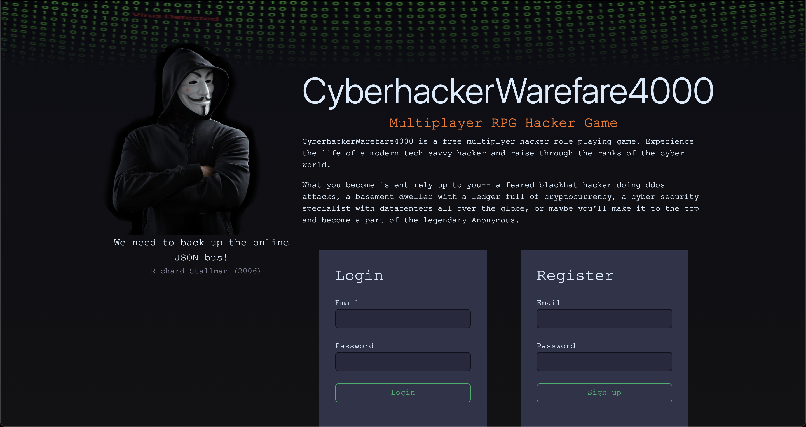

# [CyberhackerWarfare4000](https://chw4k.herokuapp.com/)

CyberHackerWareFare4000 is a free multiplyer hacker role playing game.
Experience the life of a modern tech-savvy hacker and raise through
the ranks of the cyber world.
_Best experienced on a computer screen_

## Contributing

CyberhackerWarfare4k is an open source project with one main developer. 
Feel free to contribute with pull requests, opening issues, bug reporting or sending 
feedback through [mail](tormod.flesjo@gmail.com)

## Crowdfunding

It's also possible to support the project on [Patreon](https://www.patreon.com/cyberhackerwarfare4000).
This funding is used for maintaining the project and adding new features.

## License

Distributed under the GNU General Public License v3.0. See [LICENSE](./LICENSE) for more information.

## Acknowledgments

CyberhackerWarfare4k is a sequal game made by
[Markus](https://github.com/fenrew)  and [Haakon](https://www.linkedin.com/in/haakon-foyen/)
## Contact

Created with 💙 by [Tor](https://github.com/Ojself) in his free time. Don't be too hard on me.

# Backers

- 🥉 [HaakonA](https://github.com/HaakonA)
